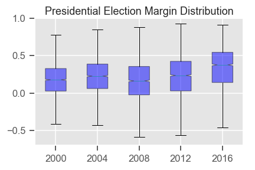

# The Divided States of America — Historical Perspectives

## Contributor
Keita Miyaki

## Questions
- Did changes in social profile of counties contribute to the political polarization?

## Datasets
- US Census: American Community Survey 5-Year Data
-- I used "Data Profile" table which offers more than 1,000 variables about broad social, economic, housing, and demographic information. 
- MIT Election Data and Science Lab: "County Presidential Election Returns 2000-2016"
-- I used vote share margins between Republican and Democratic presidential candidates at county-level

The country has never been as polarized in its modern history as it is today. It is said that in the past presidential elections there were much more competitive counties where the margins between democratic and republican candidates. Following maps depict the trend in the past five presidential elections, and you can find more white counties where the margins were narrow in 2000 than 2016. Some obvious shifts over time include deepening red color in the Midwest and the opposite in coastal California.

Darker colors indicate wider margins (blue: Democrats, red: Republican)

Voting share margin between Republican and Democratic candidates

The margins of voting shares of candidates of the Republican and Democratic parties have widened in many counties. The standard deviation of margins has been constantly increasing over past years: 0.26 in 2000, 0.29 in 2008, and 0.35 in 2016. During this time, distribution tails, i.e. non-competitive counties, have substantially increased.
In my previous article, I found that population and social profile data had a strong power to tell the 2016 presidential election results at county level. The question posited in this article is whether or not changes in population have contributed to the polarization in US politics. For instance, if cities had inflows of people whose values are aligned with the Democratic Party, they might become bluer. At the same time, if people with affinity for the Republican Party remain in the countryside, those counties would turn redder.
I found, however, that shifts in population have not driven the polarization of the nation at least in 2010–2017 period, while characteristics of elections (e.g. candidates, issues) were more accountable for the polarization trend.
In this analysis, I used the Data Profiles tables of the US Census American Community Survey (Five-year data) from 2010 to 2017, selecting 292 variables which are consistently available at county level. Missing values were imputed by XGBoost Regressor. During that period of time, there were two presidential elections. I constructed regression models with independent variables from US Census ACS and a dependent variable of vote share margin between Republican and Democratic candidates in the presidential elections.

XGBoost Regressor was also selected as the base model for the best score among other machine learning regression models. Samples were weighted by county total voting counts. Nominal errors increase by applying the weight, as shown in the figure on the left.

Yet the weighting samples leads to narrower errors in terms of voting counts. The model improves accuracy in larger counties and cities at the cost of that in smaller counties. Thus in this analysis I will use a model with sample (county)weight according to the total vote count of counties.
Firstly, I fitted the 2016 Census data and election result of the same year to the model and predicted with census data of different years. In that way we can think of hypothetical cases of 2016 election taking place in populations of different years. If the shift in population structure at county level contributed to the polarization, red counties in the result with 2010 Census data would be redder with Census data in later years.

The result is not compelling. In the following chart, you see predicted margins in a model with 2010 Census data on the x axis and difference between predictions by models with 2010 and 2016 data. If there were an upward slope, we could say red counties in 2010 had wider margins in favor of Republican candidate in 2016 and vice versa. We see, instead, a flat picture below; that means shifts in voting share margins stemming from the change in population had no apparent correlations with the initial conditions and population has not been the clear driver of polarization in general.

Voting share margin between Republican and Democratic candidates. Source: US Census
Having said that, it may be useful to know the shift in demography and social profile of counties and cities in swing states. Following charts describe voting shares of Democratic and Republican candidates predicted by 2016-model with population data in different years until 2017. In Florida where Mr. Trump won 29 electoral votes (EVs) with a narrow margin of 1.2%, the change in population structure between 2016 and 2017 favored the Republican party, while we see the opposite, benefiting Democrats in Pennsylvania whose 20 EVs were for Mr. Trump in 2016 with a 0.7% margin. The 2018 US Census ACS data will be released on December 19th, and it will be interesting to see the prediction with the latest data.

Voting share of Democratic (blue) and Republican (red) candidates. Source: US Census
Secondly, I compared two models constructed with 2012 and 2016 datasets and examined important features and errors of each model.

I found many features in common in 2012 and 2016 models as shown below. Commuting by public transportation or by their own cars matters because cities (where public transportation is available) tend to be bluer than rural counties. Units in structure (i.e. living in a stand alone house or multiple-unit apartment) and number of bedrooms are also associated with urban-rural distinctions. Those variables mattered more in 2016 than 2012; the division between cities and countryside deepened over the past four years. It is also noted that race (including “Hispanic and Latino and Race”) had a larger power in 2016 as Republicans strengthened in white counties, while Democrats increased its support in counties and cities which were more racially diverse. Detailed analysis of features that drove the 2016 election results is found in my previous article.

Feature importances in 2012 and 2016 models. Source: US Census

Root Mean Square Error of 100 trials of both models. Source: US Census
Unsurprisingly, the model errors in 2016 were statistically significantly smaller than those in 2012, indicated in the chart on the left. Population and social profiles at county level tell more about the result of the presidential election in 2016 than the previous one. That fact is one of the evidences of the deepening social cleavage in the country.
Lastly, I compared predicted margins of 2012- and 2016-models with both 2016 population data. 2012-model with 2016 data would tell what would have happened if Mr. Obama and Mr. Romney had run the presidential race in 2016.

It was clear that 2016-model result (y-axis) was much more polarized than hypothetical 2012-election result with 2016 population (x-axis). With the population unchanged, 2016-election resulted in a Republican candidate stronger in red counties and a Democratic candidate having more supports in blue cities.

Voting share margin between Republican and Democratic candidates. Source: US Census
As discussed above, I found no evidence supporting the argument that change in population structure of counties contributed to the political polarization of the United States, while it may be useful to monitor shift in population and social profiles in swing states. The polarization was rather attributed to the changes in characteristics of presidential candidates, issues and elections themselves. The 2020 election is coming soon, and we have not yet seen any clues that the polarization is alleviated so far.

Politics
Data Science
Python
Presidential Election
Xgboost

Keita Miyaki
WRITTEN BY

Keita Miyaki
Keita is an aspiring data scientist with expertise in finance and investment, a proud Japanese national, a chef, Judo black belt, a calligrapher, and a drunkard
Write the first response
More From Medium
More from Keita Miyaki
The Divided States of America
Keita Miyaki
Keita Miyaki in Keita Starts Data Science
Aug 20 · 9 min read
39

Also tagged Presidential Election
Drawing The Third Democratic Presidential Debate
Liza Donnelly
Liza Donnelly
Sep 13 · 5 min read
58

Top on Medium
Leak of Microsoft Salaries Shows Fight for Higher Compensation
Dave Gershgorn
Dave Gershgorn in OneZero
Sep 13 · 6 min read
6.5K

Discover Medium
Welcome to a place where words matter. On Medium, smart voices and original ideas take center stage - with no ads in sight. Watch
Make Medium yours
Follow all the topics you care about, and we’ll deliver the best stories for you to your homepage and inbox. Explore
Become a member
Get unlimited access to the best stories on Medium — and support writers while you’re at it. Just $5/month. Upgrade
About
Help
Legal

